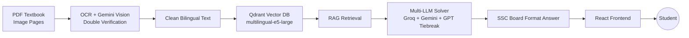

# MathAI Bangladesh

**Free AI math tutor for NCTB Class 6–10 students in Bangladesh — bilingual, curriculum-locked, and board-format accurate.**

[](#current-status)
[](#)
[](#dataset)
[](#what-makes-this-different)

## Table of Contents

- [The Problem](#the-problem)
- [What Makes This Different](#what-makes-this-different)
- [Architecture](#architecture)
- [Tech Stack](#tech-stack)
- [Dataset](#dataset)
- [Key Features](#key-features)
- [Quick Start](#quick-start)
- [Social Impact](#social-impact)
- [Current Status](#current-status)
- [Author](#author)

## The Problem

Millions of underprivileged students in Bangladesh cannot afford private math tutors or guide books. MathAI Bangladesh gives them a free, board-standard AI math tutor — available 24/7, in both Bangla and English.

## What Makes This Different

Unlike ChatGPT or generic AI tools, this system is purpose-built for the NCTB curriculum:

| | |
|---|---|
| 🎯 **Deterministic** | Answers follow the exact SSC board format — not a freeform chat response |
| 📚 **Curriculum-locked** | Grounded only in NCTB Class 6–10 textbook content, nothing outside the syllabus |
| 🌐 **Bilingual** | Full Bangla and English support, including mixed math terminology |
| ✅ **Verified** | Multi-LLM cross-check (Groq + Gemini, with GPT as tiebreaker) before an answer is shown |

## Architecture



## Tech Stack

| Layer | Technology |
|---|---|
| Backend | Python, FastAPI |
| RAG | LangChain, Qdrant Cloud |
| LLM | Groq (llama-3.3-70b), Google Gemini 2.5 Flash |
| OCR | Tesseract + Gemini Vision (double verification) |
| Embeddings | intfloat/multilingual-e5-large |
| Frontend | React, TypeScript, TailwindCSS, PWA |
| Infra | Docker, Nginx, Hostinger VPS |

## Dataset

- 5 unique NCTB textbooks (Class 6–10)
- 61 chapters across General Math and Higher Math
- Bilingual: Bangla and English editions
- ~2,500 pages processed

## Key Features

- [x] Multi-LLM cross-verification
- [x] Bilingual support (বাংলা / English)
- [x] Class-wise answer formatting (Class 6–8 / 9–10)
- [ ] Structured search: Class → Book → Chapter → Exercise → Problem
- [ ] Natural language chat mode
- [ ] SSC board-standard answer format per class tier
- [ ] 3-tier smart glossary (Bangla ↔ English math terms)
- [ ] Interactive figures for geometry theorems
- [ ] Voice input support

## Quick Start

> Full deployment guide will be published once the platform goes live. For local development:

```bash
git clone https://github.com/hasanpeal545-ai/mathai-bangladesh.git
cd mathai-bangladesh

# Backend — copy env template and fill in API keys (Groq, Gemini, Qdrant)
cp backend/.env.example backend/.env

# Run the full stack (FastAPI backend, React frontend, Postgres, Redis, Celery, Nginx)
docker-compose up --build
```

The frontend will be available at `http://localhost:3000` and the API at `http://localhost:8000`.

## Social Impact

Built for the students who cannot afford tutoring — including orphan children taught by the author for free at Quantum Foundation.

## Current Status

🔄 **Active development** — OCR pipeline complete, RAG integration in progress.

## Author

**Peal Hasan**
AI / Python / Data Science Instructor — 10 years teaching experience in Bangladesh.
Volunteer instructor at Quantum Foundation (teaching orphan children free of charge).
